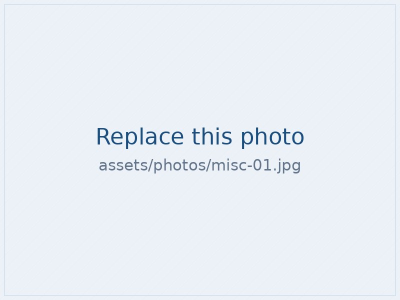

# fiorella-pizzolon.github.io

Personal academic website — Fiorella Pizzolon, Assistant Professor of Economics, Hamilton College.

Plain HTML and CSS. No build step, no framework, no dependencies. Open any `.html` file in a
browser to preview it locally.

---

## Publishing this on GitHub Pages (one time, ~10 minutes)

### 1. Create a free GitHub account

Go to [github.com/signup](https://github.com/signup). Pick a username you're happy to have in
your web address — **`fiorellapizzolon`** would give you `fiorellapizzolon.github.io`.

### 2. Create the repository

1. Click the **+** in the top right → **New repository**.
2. **Repository name:** `yourusername.github.io` — using your *exact* username.
   (If your username is `fiorellapizzolon`, the repo must be named `fiorellapizzolon.github.io`.)
3. Set it to **Public**.
4. Do **not** tick "Add a README file".
5. Click **Create repository**.

### 3. Upload the site

1. On the new empty repository page, click **uploading an existing file**.
2. Open the unzipped `site` folder on your computer, select **everything inside it**
   (the `.html` files, the `assets` folder, `README.md`, `.nojekyll`) and drag it all into the
   browser window. Drag the *contents*, not the folder itself.
3. Scroll down, click **Commit changes**.

### 4. Turn on Pages

1. In the repository, go to **Settings** → **Pages** (left sidebar).
2. Under *Build and deployment* → *Source*, choose **Deploy from a branch**.
3. Branch: **main**, folder: **/ (root)**. Click **Save**.
4. Wait 1–2 minutes, then visit `https://yourusername.github.io`.

That's it. The site is live and free forever.

---

## Making changes later

**Small text edits:** open the `.html` file on GitHub, click the pencil icon, edit, click
*Commit changes*. The live site updates in about a minute.

**Replacing files (CV, photos):** go to the folder on GitHub → **Add file** → **Upload files** →
drag the new file in. Keep the *same filename* and nothing else needs to change.

---

## Updating the News list

The News items live near the top of `index.html`, in a block that starts `<ul class="news">`.
Each line is one item:

```html
<li><span class="on">Jul 2025</span><span>Your news goes here.</span></li>
```

Copy a line, change the date and the text, and put the newest at the top. Four or five items is
about right — delete the oldest as you add new ones.

## About the photos — please read

The portrait and the 13 Misc. photos currently load **from the old Google Site's image server**,
not from this repository. That was the only way to reuse them without re-uploading, and it works —
but it means the photos depend on that old site staying up. If it is ever deleted, or Google
expires those links, the images fall back to the grey placeholders in `assets/photos/`.

**To make them permanent**, save the originals (see `save-your-photos.html`, or right-click each
image on the live site and *Save image as…*), then:

1. Upload them into `assets/photos/`, named `headshot.jpg` and `misc-01.jpg` … `misc-13.jpg`.
2. In `index.html` and `misc.html`, each `` looks like this:

   ```html
   
   ```

   Delete the long `src="https://…"` value and replace it with the `data-fallback` path:

   ```html
   
   ```

Photos display at about 800px wide — resizing originals down to ~1600px keeps the site fast.

## Other files you may want to replace

| File | What it is |
|---|---|
| `assets/cv.pdf` | Your CV (currently the July 2026 version). |
| `assets/papers/pizzolon-sovereign-debt-currency-denomination.pdf` | The sovereign debt paper, linked from the Research page. |

---

## Where things live

```
index.html          Home
cv.html             CV
education.html      Education
teaching.html       Teaching
ra-positions.html   Research positions
research.html       Research (papers, publications, talks)
media.html          Media
misc.html           Photos
assets/styles.css   All styling for the whole site
assets/favicon.svg  Browser tab icon
assets/photos/      Images
assets/papers/      Drop paper PDFs here if you want to host them yourself
.nojekyll           Tells GitHub Pages to serve the files as-is
```

### Changing the colours

Everything is set in one place — the `:root` block at the top of `assets/styles.css`.
`--accent` is the burnt-sienna used for links, buttons and section labels. Change that one value
and the whole site follows. There is a matching `@media (prefers-color-scheme: dark)` block just
below it for readers whose systems are set to dark mode.

### Fonts

Headings use **Fraunces**, body text uses **Inter**, both loaded free from Google Fonts. If either
fails to load, the browser falls back to a similar system serif / sans — nothing breaks.

---

## Using your own domain (optional, ~$12/year)

Buy a domain (Namecheap, Cloudflare, Porkbun), then in the repo go to **Settings → Pages → Custom
domain**, enter it, and add the DNS records GitHub shows you. HTTPS is automatic and free.
